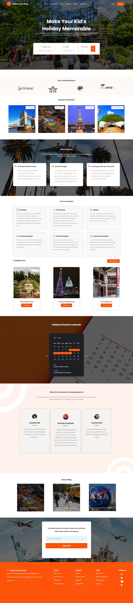

## Table of contents


- [Empire Group Travel](#empire-group-travel)
  - [Screenshot](#screenshot)
  - [Links](#links)
  - [My process](#my-process)
  - [Built with](#built-with)
  - [What I learned](#what-i-learned)
  - [Continued development](#continued-development)
  - [Useful resources](#useful-resources)
  - [Author](#author)
- [Acknowledgments](#acknowledgments)


# Empire Group Travel

Users should be able to:

- View the optimal layout depending on their device's screen size
- Route to different pages on the website.


### Screenshot



### Links

Solution Url: (https://github.com/omobankole/Empire-Travel-Group.git)
- [Figma Link](https://www.figma.com/file/iWgFSpY47P7Unso2AhgJfk/Untitled?node-id=0%3A1)

### My Process
........🥶😱😰😢😔😓😴🤔🤗😊😋😎
## Built with

- React @v18
- Semantic JSX markup
- Css modules

### What I learned
As my first react project, it was a little bit difficult from the beginning but i learned a lot in the process of building this project. firstly i learn how to create react app from different terminals and installation of react packages from npm website and their usages, react hooks(but still intermediate with most hooks as there isn't much state management in this project), use of css modules, use of semantic jsx, use of react-router-dom and more....


```jsx
export const EmpireGroup = () => {
  return (
    <div>
      <h1>Hello World</h1>
      <p>This is my first react app</p>
    </div>
  );
};
```


### Continued development

I want to focus more on react hooks such as useState, useEffect etc, folder structuring, component and props, usages of different packages and css frameworks then go back learning ES6 to it best. more so get prepared for what coming next.

### Useful resourses

- [React](https://www.reactjs.org) - Best way to learn react is by going through their documentation.
- [Youtube](https://www.youtube.com) - I think everyone needs youtube.

## Author

- Twitter - [@omobankole1](https://www.twitter.com/omobankole1)
- Github - [@omobankole](https://www.github.com/omobankole)
- LinkedIn - [@bankole olatunji](https://www.linkedin.com/in/bankole-yusuf-olatunji/)
## Acknowledgments
 I really want to thank grazac academy for giving me great opportunity to be one of their student in this ongoing cohort and secondly tutor mayowa for the smooth interactive and comprehended classes. Victor, Mr dare for putting me through and lastly my coursemates. you all are wonderful and i really appreciate you all for your hard work and dedication.
